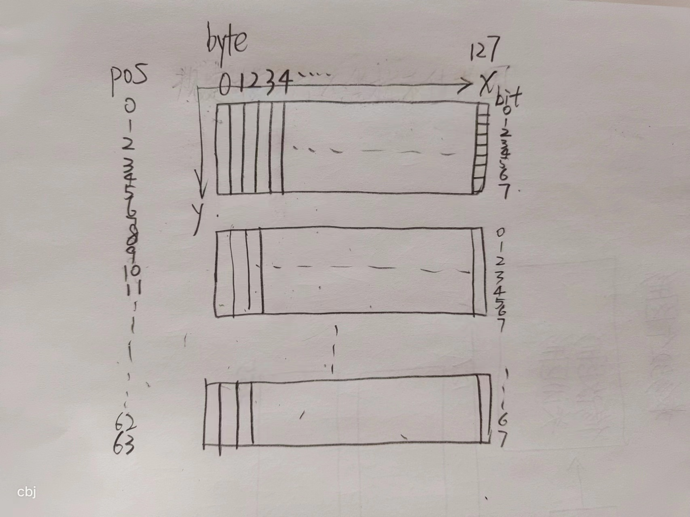
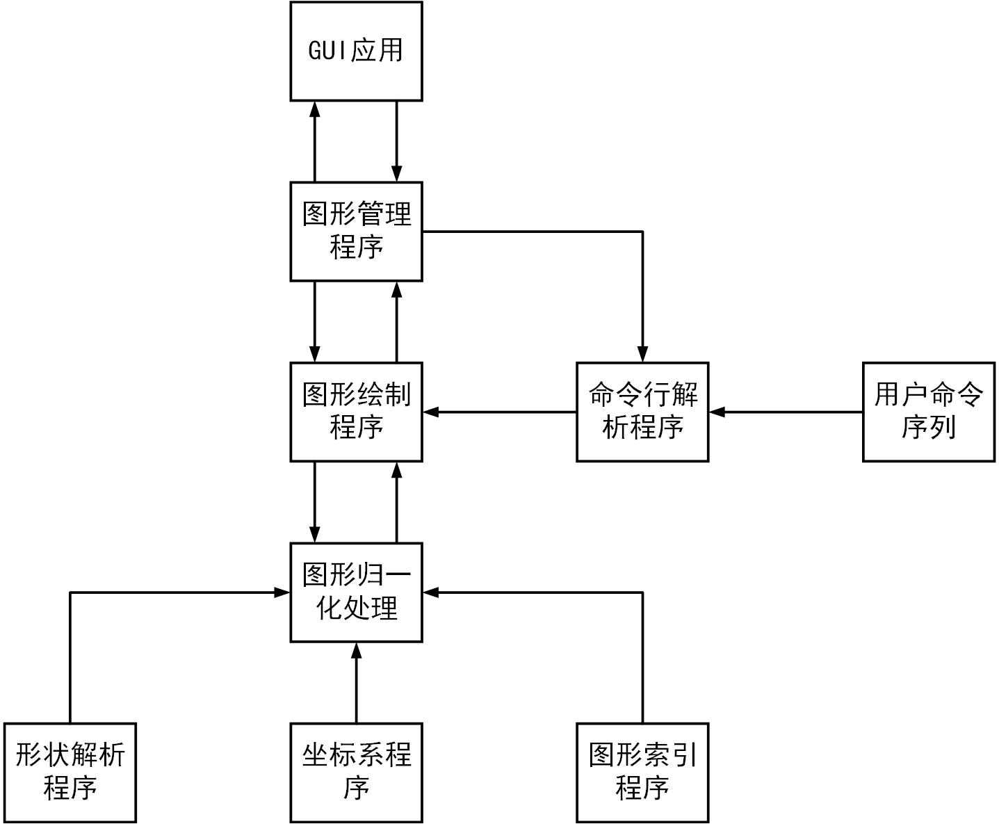

# 软件工程项目

## 0 功能简介

实现解释命令行并操作图形库,在128×64的OLED屏幕上完成画图功能.可以实现嵌入式图形界面的辅助设计. 

128×64的OLED由SSD1306芯片驱动,只能显示二值图像.单片机可以使用串行通信访问,支持I2C和SPI接口.

可以实现图形界面调用绘图库,辅助嵌入式开发人员设计界面

下图为OLED屏幕的数据格式:OLED屏幕显示的二值图像中,每个像素由一个二进制位表示,一个字节可以表示8行1列的二进制图像.一共128列64行,每8行为1组,一共有8组.可以用长度为1024的字符数组表示一个画面,如下图所示.在绘图时,为防止意外修改图像,此数组仅能通过接口访问.

本程序通过MSVC编译器编译,所有的`char`按无符号处理



本程序运行流程主要如下图所示：



## 1 图形库

这部分程序实现把图形信息转换为OLED图像,配合嵌入式硬件(如STM32,CH341A等)和128×64的OLED屏幕可以直接在OLED屏幕上显示图像.

**0 绘制一个点**

函数原型:

```c
void gui_setpixel(char x, char y, char color);
```

参数说明:

`x`:目标点的列数 取值范围$0\le x\le 127$

`y`:目标点的行数 取值范围$0\le y\le 63$

`color`:目标点的颜色,若为黑色,取0.若为白色,取非0值(例如1)

**1 绘制一条直线**

函数原型

```c
void gui_line(char x1, char y1, char x2, char y2, char color);
```

参数说明:

两点确定一条直线,由起点和终点绘图.

`x1`:起点的列数	`y1`:起点的行数

`x2`:终点的列数	`y2`:终点的行数 

`color`:目标直线的颜色,若为黑色,取0.若为白色,取非0值(例如1)

数据范围:

$0\le x1,x2\le 127$

$0\le y1,y2\le 63$

**2 填充一个矩形区域**

函数原型

```c
void gui_fillrect(char x1, char y1, char x2, char y2, char color);
```

参数说明:

两点确定一条直线,作为矩形的对角线.这里的对角线连接矩形的左上角和右下角

`x1`:矩形左上角点的列数	`y1`:矩形左上角点的行数

`x2`:矩形右下角点的列数	`y2`:矩形右下角点的行数 

`color`:目标矩形区域的颜色,若为黑色,取0.若为白色,取非0值(例如1)

数据范围:

$0\le x1,x2\le 127$

$0\le y1,y2\le 63$

**3 绘制空心矩形**

函数原型

```c
void gui_rect(char x1, char y1, char x2, char y2, char color);
```

参数说明:

两点确定一条直线,作为矩形的对角线.这里的对角线连接矩形的左上角和右下角

`x1`:矩形左上角点的列数	`y1`:矩形左上角点的行数

`x2`:矩形右下角点的列数	`y2`:矩形右下角点的行数 

`color`:目标矩形边界的颜色,若为黑色,取0.若为白色,取非0值(例如1)

数据范围:

$0\le x1,x2\le 127$

$0\le y1,y2\le 63$

**4 绘制圆**

函数原型

```c
void gui_circle(char xc, char yc, char r, char color);
```

参数说明

由圆心和半径确定一个圆.

`xc`:圆心的列数,取值范围$0\le xc\le 127$

`yc`:圆心的行数,取值范围$0\le yc\le 127$

`r`:圆的半径,取值要求不能超出绘图的区域

`color`:目标圆边界的颜色,若为黑色,取0.若为白色,取非0值(例如1)

**5 杂项**

```c
void gui_clear(char color);
void gui_reverse_color();
char gui_export_ram_source(const char *filename);
void gui_export_ram_array(char *buffer);
```


## 2 简易命令行

支持通过命令行在矩形区域上绘图.约定背景为黑色,绘制白色的图像.

### 0 图形的表示


**0 点的表示**

```c
typedef struct _point{
    char x, y;
}point;
```

`x`和`y`分别为点的列号,行号

**1 直线,矩形,填充矩形的表示**

```c
typedef struct _pointpair{
    char x1, y1;
    char x2, y2;
}line, rect, filled_rect;
```

`x1`和`y1`分别为直线起点的列号,行号.起点为$(x1,y1)$

`x2`和`y2`分别为直线终点的列号,行号.终点为$(x2,y2)$

若把起点视为矩形的左上角点,终点视为矩形的右下角点,则可以确定矩形区域.

**2 圆的表示**
```c
typedef struct _circle{
    char x, y, r;
}circle;
```
**3 三角形的表示**
```c
typedef struct _triangle{
    char x1, y1, x2, y2, x3, y3;
}triangle;
```
**4 图形的数据结构**
图形类型枚举

```c
typedef enum _shapetype{
        UNUSED = 0,//not used
        POINT = 1,
        LINE = 2,
        RECT = 3,
        FILLEDRECT = 4,
        CIRCLE = 5,
        TRIANGLE = 6
}shapetype;
```

说明
`UNUSED`,值为0,若图形类型为此值,将视为不存在.
`POINT`,值为1,图形存在,为一个点
`LINE`,值为2,图形存在,为一条直线
`RECT`,值为3,图形存在,为一个空心矩形
`FILLEDRECT`,值为4,图形存在,为一个实心矩形
`CIRCLE`,值为5,图形存在,为一个圆
`TRIANGLE`,值为6,为一个空心三角形

完整结构声明
```c
typedef struct _shape{
    shapetype type;
    char isshow;
    union _data{
        point pt;
        line lin;
        circle circ;
        triangle tri;
    }data;        
}shape;
```
说明
`shapetype`:图形类型,枚举型
`isshow`:是否绘制标记变量.
若`shapetype`为0则此项无意义.
若`shapetype`为非0值且此项为0,图形存在,但是将不会绘制.
若`shapetype`和此项都不为0,图形存在,且将会绘制.

`data`:图形信息,联合型
由`shapetype`确定如何解释此联合类型.
若`shapetype`为0则此项无意义.
若`shapetype`为非0值表示图形的参数

- 若`shapetype`为`POINT`,表示一个点,通过`pt`访问点的坐标
- 若`shapetype`为`LINE`,表示一条直线,通过`lin`访问直线起点和终点的坐标
- 若`shapetype`为`RECT`,表示一个空心矩形,通过`lin`访问矩形左上角和右下角的坐标
- 若`shapetype`为`FILLEDRECT`,表示一个实心矩形,通过`lin`访问矩形左上角和右下角的坐标
- 若`shapetype`为`CIRCLE`,表示一个圆,通过`circ`访问圆心坐标和半径
- 若`shapetype`为`TRIANGLE`,表示一个空心三角形,通过`tri`访问三角形三个点的坐标


默认全局最多支持画32个图形,可以通过`MAX_SHAPE_COUNT`宏调整最大支持的图形数量

### 1 命令格式

一般的格式为`cmd_name param1 param2 param3 ...`其中

`cmd_name`:命令名,目前支持的命令如第2节介绍

`param1`等往后为参数

### 2 命令列表

### 0 图形使用命令

**0 关闭指定图形**

`disable index`

修改编号为`index`的图形的`shapetype`为`UNUSED`,禁用该图形

**1 设置图形是否显示**

`enabledraw index mode`

修改编号为`index`的图形的`isshow`标记变量为`mode`

**2 显示一个点**

`point index x y`

**3 在当前图像上绘制**

`draw`

**4 刷新图像,重新绘制**

`redraw`

**6 画布反色**

`colorrev`

**7输出文件**

`export`

### 1 直线命令

**0 两点确定一条直线**

`line index x1 y1 x2 y2`

**1 起点,方向向量,长度**

`linevl index xstart ystart xdir ydir length`

**2 起点 方向向量,(方向向量的模即为长度)**

`linev index xstart ystart xdir ydir`

### 2 矩形命令

下面所有的命令中都有`fill`.

若`fill`为0将绘制空心矩形,否则绘制实心

**0 左上角 右下角**

左上角坐标$(x1,y1)$右下角坐标$(x2,y2)$

`rect index x1 x2 y1 y2 fill`

**1 中心 高度 宽度**

中心坐标$(x,y)$ 宽度`w` 高度`h`

`rectc index x y w h fill`

**2 正方形 中心 边长**

中心坐标$(x,y)$ 边长`a`

`square index x y a fill`

### 3 圆命令

**0 圆心 半径**

圆心坐标$(x,y)$ 半径`r `

`circ index x y r`

**1 圆心 直径**

圆心坐标$(x,y)$ 直径`d `

`circd index x y d`

**2 三点圆**

时间紧就先不实现

### 4 三角形命令

三点坐标

`triangle index x1 y1 x2 y2 x3 y3`

### 5 多边形命令 图形平移命令

时间紧就先不实现

## 3 图形接口(GUI)


简易命令行,输入命令,将命令显示在文本框中,输出执行结果,单击预览oled图可以预览执行命令的结果.

## 4 软件整体组成
本软件主要包含四个部分，分别是命令行解码模块，数学几何运算模块，图形用户界面模块，坐标系管理模块和通用模块。

数据流按以下进行：用户输入`UI`-`json`-`txtcmd`命令序列-->`stdcmd`标准化数据序列-->`graph`形状序列-->`stdcmd`标准化数据序列-->`json`-->`UI`画面显示。

### 4.1 命令行解码程序
实现功能：将用户输入的命令提取数据和命令信息，转化为命令序列，然后在对应的标准化数据序列中进行对应的操作，如新建形状、删除形状、形状变换等。

### 4.2 数学几何运算模块
实现功能：保证整个软件过程中的数学代数和几何运算，提供诸如坐标平移、旋转、求交并补等运算。

### 4.3 图形用户界面
实现功能：提供与用户交互的界面，同时绘制出用户命令对应的结果。

### 4.4 标准化数据序列

### 4.5	坐标系管理模块

### 4.6 各子模块层级关系


## 5	分工